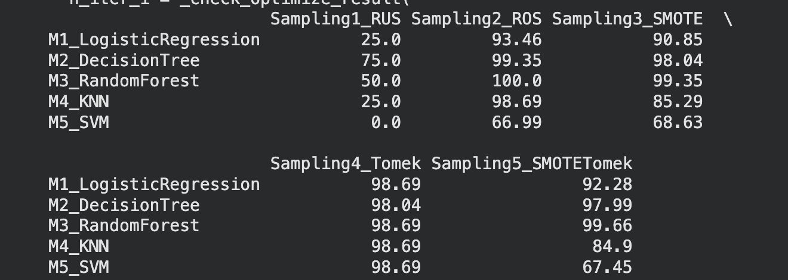

# Sampling Techniques on Imbalanced Credit Card Dataset

## Objective
The objective of this project is to analyze the impact of different **sampling techniques** on a **highly imbalanced credit card fraud dataset** and evaluate how these techniques affect the performance of various **machine learning models**.

---

## Dataset
- Dataset: `Creditcard_data.csv`
- Target Variable: `Class`
  - `0` → Legitimate transaction  
  - `1` → Fraudulent transaction  
- The dataset is highly imbalanced, making it suitable for studying sampling strategies.

---

## Machine Learning Models Used
| Model ID | Algorithm |
|--------|----------|
| M1 | Logistic Regression |
| M2 | Decision Tree |
| M3 | Random Forest |
| M4 | K-Nearest Neighbors |
| M5 | Support Vector Machine |

---

## Sampling Techniques Applied
| Sampling ID | Technique |
|------------|----------|
| Sampling1 | Random Undersampling |
| Sampling2 | Random Oversampling |
| Sampling3 | SMOTE |
| Sampling4 | Tomek Links |
| Sampling5 | SMOTE + Tomek |

---

## Methodology
1. Load the imbalanced dataset.
2. Apply five different sampling techniques to balance the dataset.
3. Split each balanced dataset into training and testing sets.
4. Train five different machine learning models on each sampled dataset.
5. Evaluate model performance using **accuracy**.
6. Compare results across sampling techniques and models.

---

## Results

The following image shows the accuracy comparison of all machine learning models across different sampling techniques:

---

## Best Sampling Technique per Model
- **Logistic Regression:** SMOTE + Tomek (Sampling5)
- **Decision Tree:** SMOTE (Sampling3)
- **Random Forest:** Random Undersampling (Sampling1)
- **KNN:** Random Undersampling (Sampling1)
- **SVM:** Random Undersampling (Sampling1)

---

## Conclusion
The results show that no single sampling technique performs best for all models.  
Tree-based models such as **Random Forest** benefit from **undersampling**, while linear models like **Logistic Regression** perform better with **hybrid sampling techniques**.  
This highlights the importance of selecting sampling strategies based on the machine learning model being used.

---
